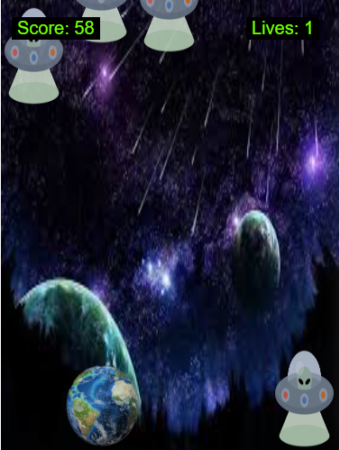
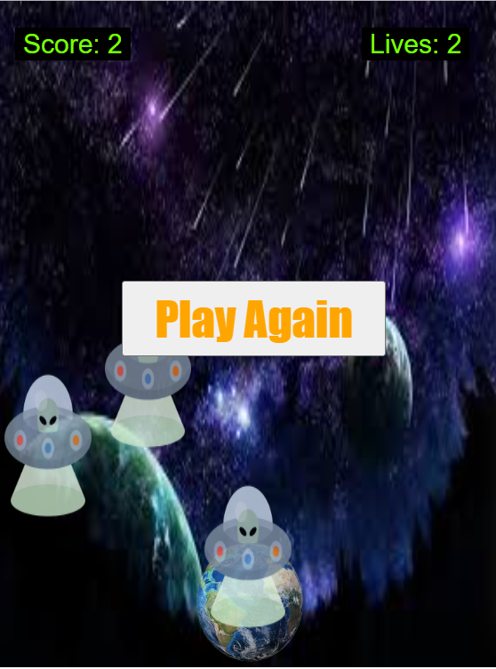

# SPACE-SURVIVAL GAME

**Instructions:-**

**Task**: Let's protect earth from aliens by using left arrow 🡸 and right arrow 🡺 keys on keyboard.

**Warning**: No of aliens increases after player has scored above 30 points.

**Power**: Once player scored above 60 points, it gets power to make aliens disappear.
Player can use this power with arrow up 🡹 key on keyboard

**Lives**: Player have 3 lives to play the game each time and score as high as possible.
 
 

**Link**

Click to play -> https://maneetbhatia.github.io/space-survival/
 
 

**Screenshots**

 
 

 
 

 
 

**Built With**

- HTML 5
- CSS 3
- Javascript
   
   

**Images By**

Maneet Singh - https://maneetbhatia.github.io/space-survival/
 
 

**Author**

Maneet Singh - https://maneetbhatia.github.io/space-survival/
 
 

**License**

This project is licensed under the MIT License - see the https://maneetbhatia.github.io/space-survival/ file for details
